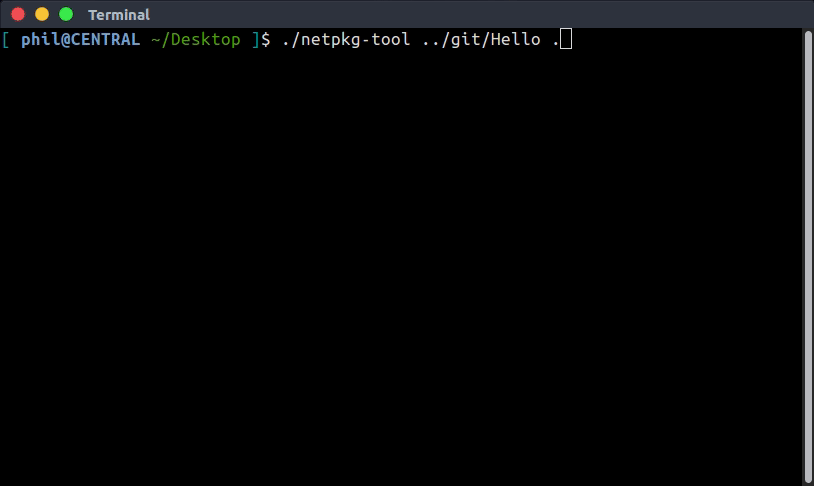
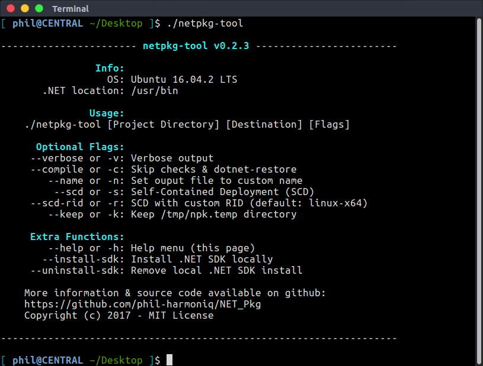

# netpkg-tool [![License][License]](LICENSE.md) [](https://travis-ci.org/phil-harmoniq/netpkg-tool)

[License]: https://img.shields.io/badge/License-MIT-blue.svg

A pre-packaged version of the most current netpkg-tool is available from the [releases tab](https://github.com/phil-harmoniq/netpkg-tool/releases):

```bash
wget https://github.com/phil-harmoniq/netpkg-tool/releases/download/master/netpkg-tool
chmod a+x netpkg-tool
```

To build netpkg-tool from source, just run `build.sh` and specify a destination folder:

```bash
git clone https://github.com/phil-harmoniq/netpkg-tool
./netpkg-tool/build.sh .
```

## Example

```bash
# Download netpkg-tool and compile a simple .NET Core app
wget https://github.com/phil-harmoniq/netpkg-tool/releases/download/master/netpkg-tool
git clone https://github.com/phil-harmoniq/Hello
chmod a+x netpkg-tool
./netpkg-tool Hello .
./Hello.npk one two three
```

[Hello App Source](https://github.com/phil-harmoniq/Hello)



More examples coming soon.

## Usage

Run netpkg-tool and specify a .NET project folder and a destination folder:

```bash
./netpkg-tool [Project Folder] [Destination] [Flags]
```

There are several optional commands that offer more control:



## Requirements

* [appimagetool](https://github.com/probonopd/appimagekit/) - bundles binaries along with needed libraries into a single file
* [.NET Core 2.0 SDK](https://github.com/dotnet/core/blob/master/release-notes/download-archives/2.0.0-preview1-download.md) - open-source implementation of Microsoft's .NET framework
  * v2.0 introduced the `linux-x64` [Runtime Identifier (RID)](https://github.com/dotnet/docs/blob/master/docs/core/rid-catalog.md) to replace the individual Linux distro RID's to simplify distribution. You must have a linux-x64 RID in your project to use SCD.

Note: netpkg-tool can attempt to install these locally to your home directory

## Details

Using netpkg-tool will restore and compile your project based on settings in your `*.csproj` file. By default; netpkg-tool will use [Framework Dependent Deployment](https://docs.microsoft.com/en-us/dotnet/core/deploying/#framework-dependent-deployments-fdd) to compile your project and create a customized AppImage with the extension `*.npk`. To use [Self-Contained Deployment](https://docs.microsoft.com/en-us/dotnet/core/deploying/#self-contained-deployments-scd), use the `--scd` flag and designate your target Linux Distro; the resulting file will have an `*.AppImage` extension. The full process for netpkg-tool:

1. Check for .NET Core SDK (netpkg-tool can download if missing)
2. Restore project dependencies
3. Compile .NET Core app
4. Create AppDir and transfer files
5. Run appimagetool on created AppDir
6. Delete temporary files

## .AppImage vs .npk

TL;DR: Essentially, an `.npk` file *is* an `.AppImage` file with some extra features.

.NET Core supports two types of application deployment, [Framework Dependent Deployment (SCD)](https://docs.microsoft.com/en-us/dotnet/core/deploying/#framework-dependent-deployments-fdd) and [Self-Contained Deployment (FDD)](https://docs.microsoft.com/en-us/dotnet/core/deploying/#self-contained-deployments-scd). The concept behind FDD seems to contradict the philosophy behind AppImage but could still be beneficial for console applications. SCD is more suited to the problem AppImage tries to solve but comes out much larger.

Since .NET Core is not installed by default on most Linux distrobutions, it seemed appropriate to designate .NET applications created using FDD with a different file extension and to include tools relevant to ensure a functioning .NET runtime. There are a few extra tools available to `.npk` files that make the process of checking for, installing, uninstalling, and updating .NET Core simpler. An `.npk` file will also designate some useful environment variables including `$HERE` as suggested for AppImages.

Using netpkg-tool with SCD eliminates the need for any of the extra goodies that come with an `.npk`, so none of those tools are included when you run netpkg-tool using the `--scd` flag. The resulting file will have an `.AppImage` extension and won't be reliant on .NET being installed.

## Disclaimer

The netpkg-tool project is still in alpha development. Names, commands, and features are subject to change. Please keep this in mind when using this repo.
